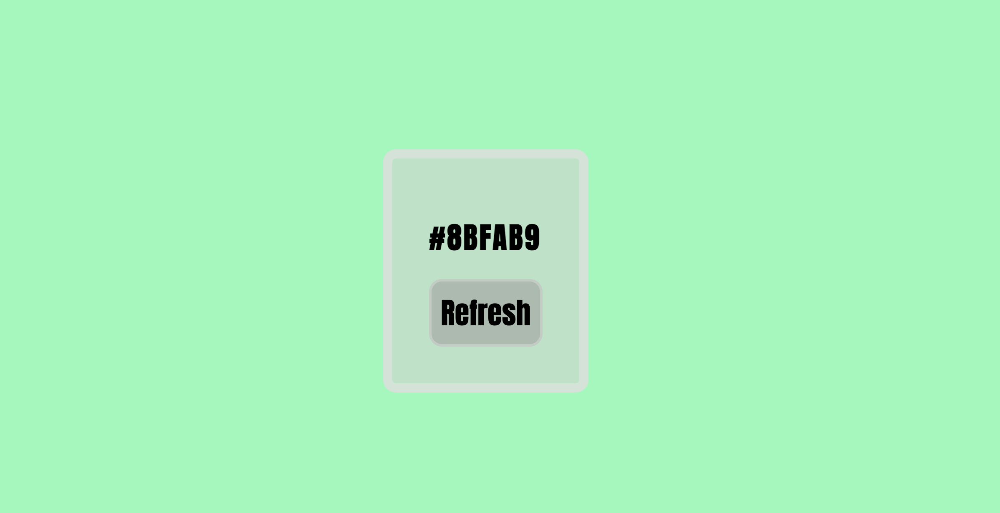

# DOM / Javascript

Document Object Model / Javascript 

## Lesson Learned

1. DOM
2. Javascript

# Projec Image

## See the the repo [click here.](https://github.com/MiguelCamilo/Color-Generator-js)
